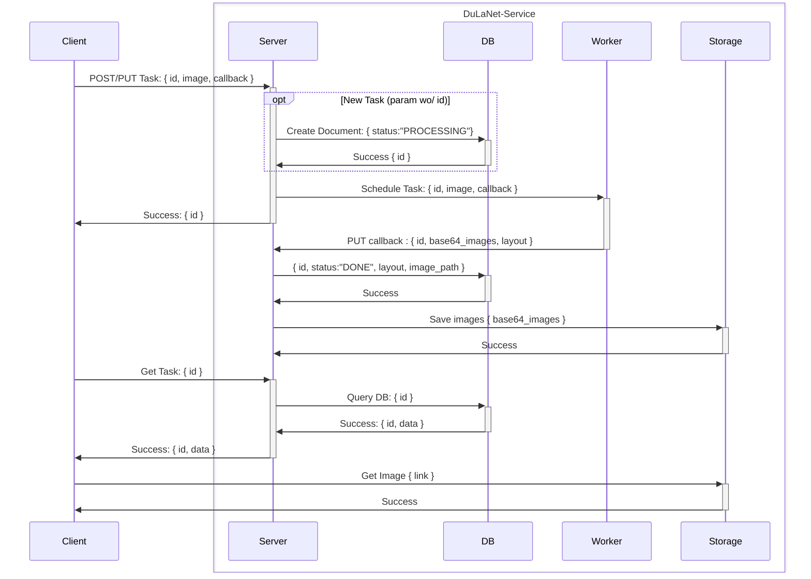

# dula-net-webapp

## Quick Start

1. Start services: `docker-compose up -d`
2. Explore API details on Swagger UI at [http://localhost](http://localhost).
3. Inspect MongoDB at [http://localhost/mongoadmin](http://localhost/mongoadmin). (Password is in the `docker-compose.yml` file.)

### Useful Commands:

- Shutdown services: `docker-compose down`
- Check service status: `docker ps`
- Build Dockerfile if changed: `docker-compose build`
- View logs: `docker-compose logs -f ${server, worker}`
- Restart services: `docker-compose restart`

## Docker Volumes

- Find result data in the `assets/storage` directory.
- Database data is stored in the `db` directory.

## API Endpoints

- **GET /api/admin/tasks**: Retrieve all tasks.
- **GET /api/task**: Retrieve a specific task.
- **DELETE /api/task**: Mark a task as deleted.
- **POST /api/task**: Execute a task.
- **PUT /api/task**: Update a task result with a new image.

## Dataflow

